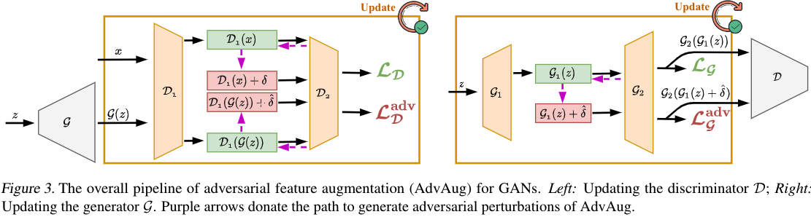
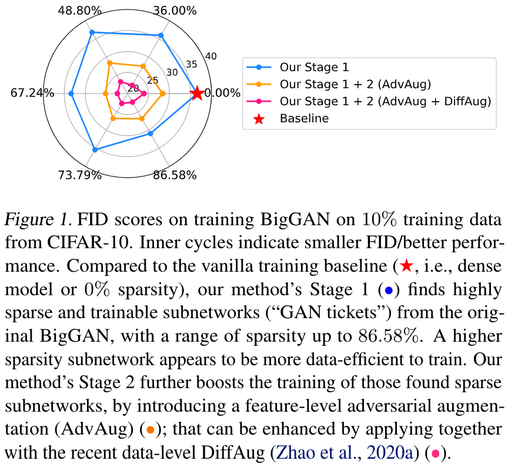

# Ultra-Data-Efficient GAN Training: Drawing A Lottery Ticket First, Then Training It Toughly

[](https://opensource.org/licenses/MIT)

Code for this paper [Ultra-Data-Efficient GAN Training: Drawing A Lottery Ticket First, Then Training It Toughly](). [Preprint]

Tianlong Chen, Yu Cheng, Zhe Gan, Jingjing Liu, Zhangyang Wang.


## Overview

Training generative adversarial networks (GANs) with limited data generally results in deteriorated performance and collapsed models. To conquerthis challenge, we are inspired by the latest observation of [Kalibhat et al. (2020)](https://arxiv.org/pdf/2010.02350.pdf); [Chen et al.(2021d)](https://openreview.net/pdf?id=1AoMhc_9jER), that one can discover independently trainable and highly sparse subnetworks (a.k.a.,lottery tickets) from GANs. Treating this as aninductive prior, we decompose the data-hungry GAN training into two sequential sub-problems: 

- (i) identifying the lottery ticket from the  original GAN;
- (ii) then training the found sparse subnetwork with aggressive data and feature augmentations.

Both sub-problems re-use the same small training set of real images. Such a coordinated framework enables us to focus on lower-complexity and more data-efficient sub-problems, effectively stabilizing trainingand improving convergence.


## Methodology




## Experiment Results



More experiments can be found in [our paper]().


## Implementation

**For the first step, finding the lottery tickets in GAN is referred to this [repo](https://github.com/VITA-Group/GAN-LTH).**

For the second step, training GAN ticket toughly are provides as follow:

### Environment for SNGAN

```shell
conda install python3.6
conda install pytorch1.4.0 -c pytorch
pip install tensorflow-gpu==1.13
pip install imageio
pip install tensorboardx
```

R.K. Donwload fid statistics from [Fid_Stat](https://www.dropbox.com/sh/lau1g8n0moj1lmi/AACCBGqAhSsjCcpA78VND18ta?dl=0).

### Commands for SNGAN

R.K. Limited data training for SNGAN

- Dataset: CIFAR-10

Example for full model training on 20% limited data (**--ratio 0.2**):

```shell
python train_less.py -gen_bs 128 -dis_bs 64 --dataset cifar10 --img_size 32 --max_iter 50000 --model sngan_cifar10 --latent_dim 128 --gf_dim 256 --df_dim 128 --g_spectral_norm False --d_spectral_norm True --g_lr 0.0002 --d_lr 0.0002 --beta1 0.0 --beta2 0.9 --init_type xavier_uniform --n_critic 5 --val_freq 20 --exp_name sngan_cifar10_adv_gd_less_0.2 --init-path initial_weights --ratio 0.2
```

Example for full model training on 20% limited data (**--ratio 0.2**) with AdvAug on G and D:

```shell
python train_adv_gd_less.py -gen_bs 128 -dis_bs 64 --dataset cifar10 --img_size 32 --max_iter 50000 --model sngan_cifar10 --latent_dim 128 --gf_dim 256 --df_dim 128 --g_spectral_norm False --d_spectral_norm True --g_lr 0.0002 --d_lr 0.0002 --beta1 0.0 --beta2 0.9 --init_type xavier_uniform --n_critic 5 --val_freq 20 --exp_name sngan_cifar10_adv_gd_less_0.2 --init-path initial_weights --gamma 0.01 --step 1 --ratio 0.2
```

Example for sparse model (i.e., **GAN tickets**) training on 20% limited data (**--ratio 0.2**) with AdvAug on G and D:

```shell
python train_with_masks_adv_gd_less.py -gen_bs 128 -dis_bs 64 --dataset cifar10 --img_size 32 --max_iter 50000 --model sngan_cifar10 --latent_dim 128 --gf_dim 256 --df_dim 128 --g_spectral_norm False --d_spectral_norm True --g_lr 0.0002 --d_lr 0.0002 --beta1 0.0 --beta2 0.9 --init_type xavier_uniform --n_critic 5 --val_freq 20 --exp_name sngan_cifar10_adv_gd_less_0.2 --init-path initial_weights --gamma 0.01 --step 1 --ratio 0.2 --rewind-path <>
```

- --rewind-path: the stored path of identified sparse masks

### Environment for BigGAN

```shell
conda env create -f environment.yml studiogan
```

### Commands for BigGAN

R.K. Limited data training for BigGAN

- Dataset: TINY ILSVRC

Example: 

```shell
python main_ompg.py -t -e -c ./configs/TINY_ILSVRC2012/BigGAN_adv.json --eval_type valid --seed 42 --mask_path checkpoints/BigGAN-train-0.1 --mask_round 2 --reduce_train_dataset 0.1 --gamma 0.01 
```

- --mask_path: the stored path of identified sparse masks
- --mask_round: the sparsity level = 0.8 ^ mask_round
- --reduce_train_dataset: the size of used limited training data
- --gamma: hyperparameter for AdvAug. You can set it to 0 to git rid of AdvAug

----------------------------------------------------------

- Dataset: CIFAR100 

Example:

```shell
python main_ompg.py -t -e -c ./configs/CIFAR100_less/DiffAugGAN_adv.json --ratio 0.2 --mask_path checkpoints/diffauggan_cifar100_0.2 --mask_round 9 --seed 42 --gamma 0.01
```

- DiffAugGAN_adv.json: it indicate this confirguration use [DiffAug](https://arxiv.org/pdf/2006.10738.pdf).

### Pre-trained Models

- SNGAN / CIFAR-10 / 10% Training Data / 10.74% Remaining Weights

https://www.dropbox.com/sh/7v8hn2859cvm7jj/AACyN8FOkMjgMwy5ibVj61IPa?dl=0

- SNGAN / CIFAR-10 / 10% Training Data / 10.74% Remaining Weights + AdvAug on G and D

https://www.dropbox.com/sh/gsklrdcjzogqzcd/AAALlIYcWOZuERLcocKIqlEya?dl=0

- BigGAN / CIFAR-10 / 10% Training Data / 13.42% Remaining Weights + DiffAug + AdvAug on G and D

https://www.dropbox.com/sh/epuajb1iqn5xma6/AAAD0zwehky1wvV3M3-uesHsa?dl=0

- BigGAN / CIFAR-100 10% / Training Data / 13.42% Remaining Weights + DiffAug + AdvAug on G and D

https://www.dropbox.com/sh/y3pqdqee39jpct4/AAAsSebqHwkWmjO_O8Hp0hcEa?dl=0

- BigGAN / Tiny-ImageNet / 10% Training Data / Full model

https://www.dropbox.com/sh/2rmvqwgcjir1p2l/AABNEo0B-0V9ZSnLnKF_OUA3a?dl=0

- BigGAN / Tiny-ImageNet / 10% Training Data / Full model + AdvAug on G and D

https://www.dropbox.com/sh/pbwjphualzdy2oe/AACZ7VYJctNBKz3E9b8fgj_Ia?dl=0

- BigGAN / Tiny-ImageNet / 10% Training Data / 64% Remaining Weights

https://www.dropbox.com/sh/82i9z44uuczj3u3/AAARsfNzOgd1R9sKuh1OqUdoa?dl=0

- BigGAN / Tiny-ImageNet / 10% Training Data / 64% Remaining Weights + AdvAug on G and D

https://www.dropbox.com/sh/yknk1joigx0ufbo/AAChMvzCsedejFjY1XxGcaUta?dl=0

## Citation

```

```


## Acknowledgement

https://github.com/VITA-Group/GAN-LTH

https://github.com/GongXinyuu/sngan.pytorch

https://github.com/VITA-Group/AutoGAN

https://github.com/POSTECH-CVLab/PyTorch-StudioGAN

https://github.com/mit-han-lab/data-efficient-gans

https://github.com/lucidrains/stylegan2-pytorch
